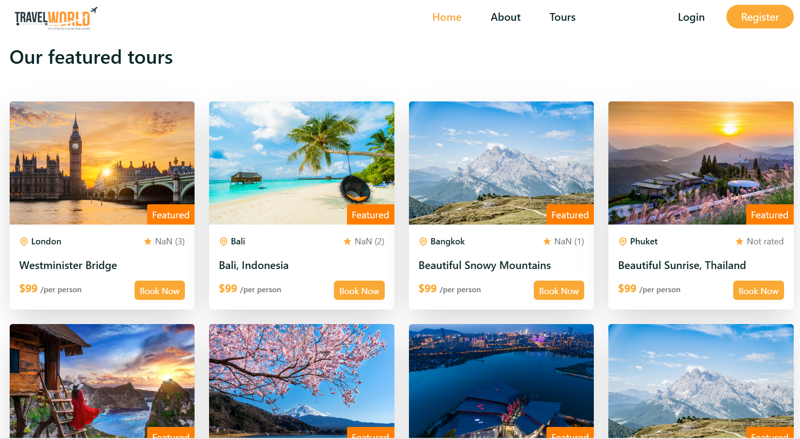
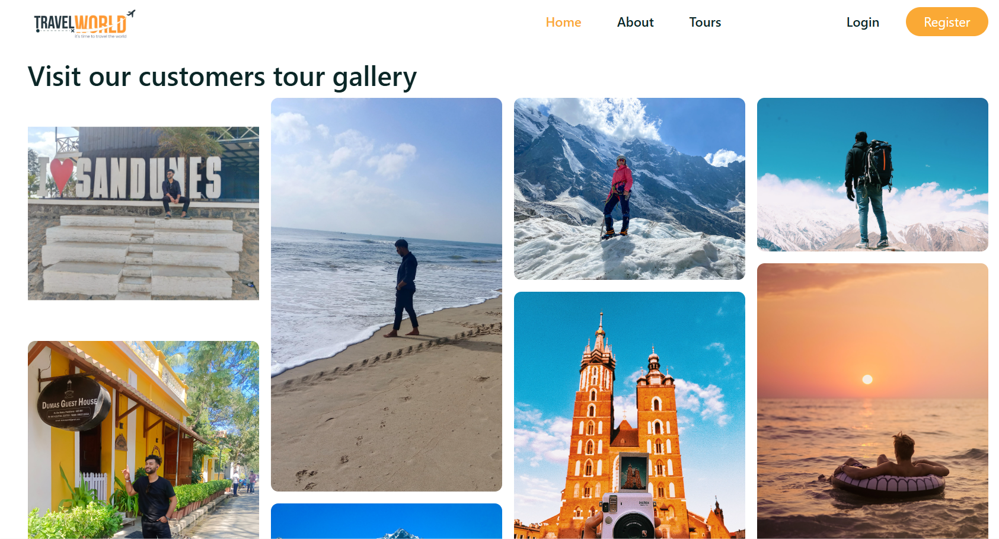

# 🧭 Tour & Travel Booking Website (MERN Stack)

<h1 align="center">✈️ Tour & Travel Booking Website – MERN Stack Project</h1>

  
  
  
  

 🌍 A full-stack web application to browse, book, and manage travel tours with authentication, booking history, and an admin dashboard.

---

## 🔗 Live Demo

> 🌐 **Deployed URL**: [https://rishikesh-tour-management.netlify.app/home](https://rishikesh-tour-management.netlify.app/home)

---

## 🖼️ Preview

  
  
  

---

## 🛠 Tech Stack

| Frontend | Backend | Database | Deployment |
|----------|---------|----------|-------------|
| React, React Router, Axios, Bootstrap/CSS | Node.js, Express.js | MongoDB Atlas (Mongoose ODM) | Netlify (Frontend), Render/Heroku (Backend) |

---

## ✨ Features

- 🔐 Secure Authentication (JWT-based)
- 🌍 Browse & Search Tours
- 📅 Book tours with custom dates
- 📁 User Profile with Booking History
- 📊 Admin Dashboard to manage tours & users
- 📱 Fully Responsive UI (Mobile + Desktop)
- 🛠 RESTful API with Error Handling

---

## 📁 Project Structure

